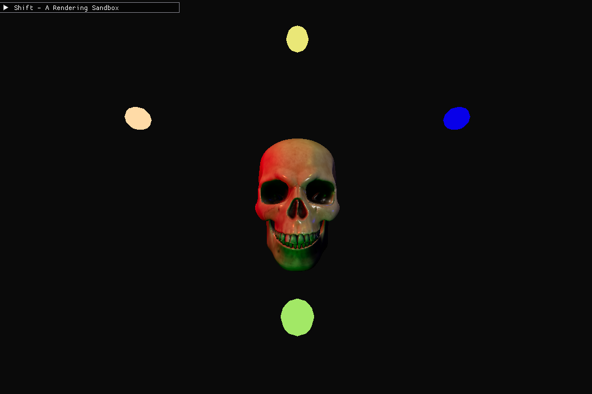
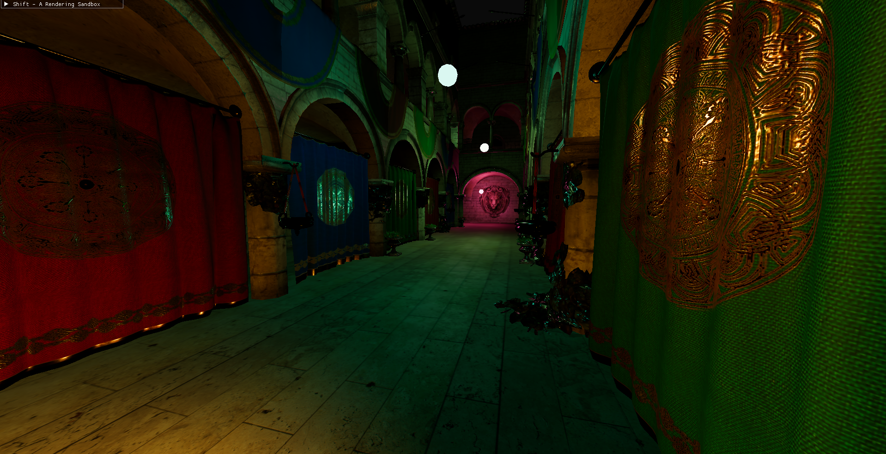
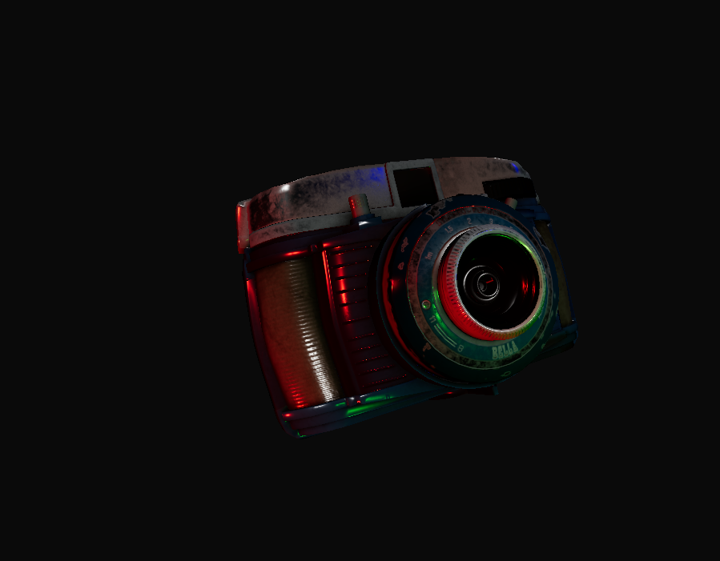
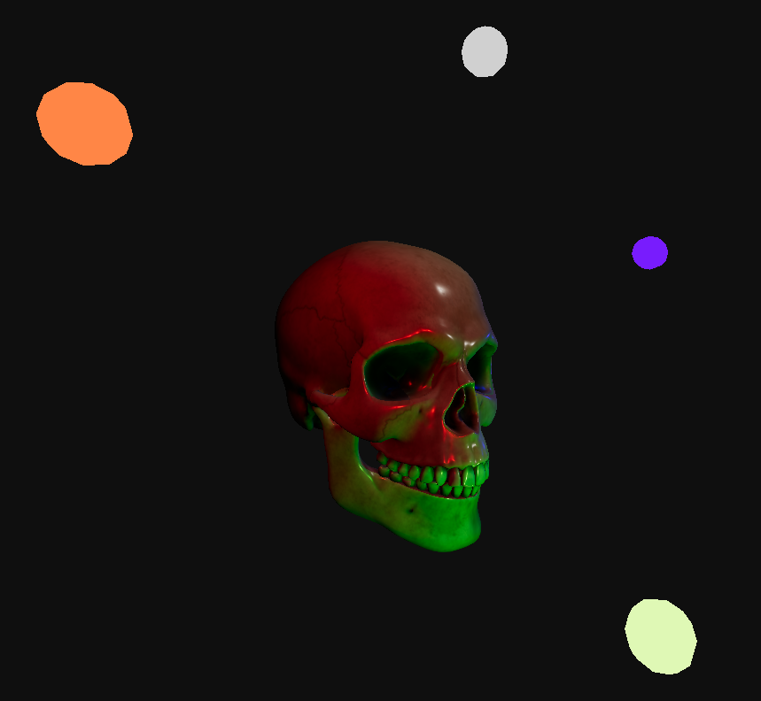
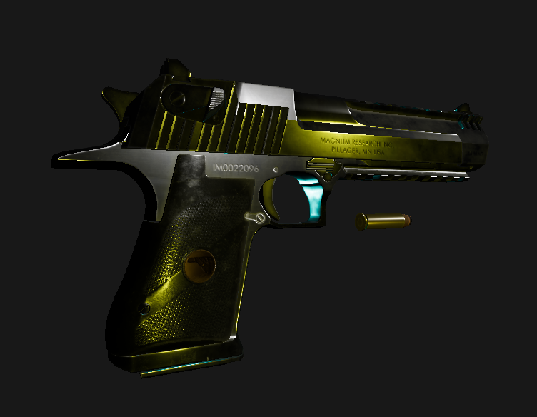
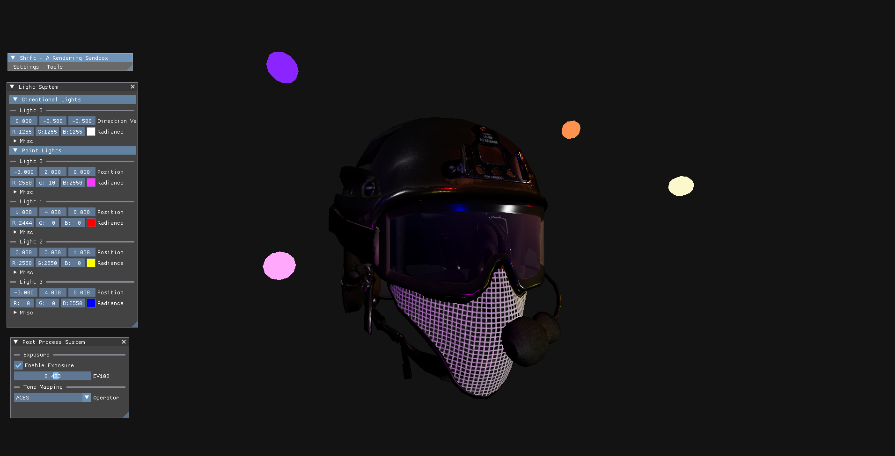
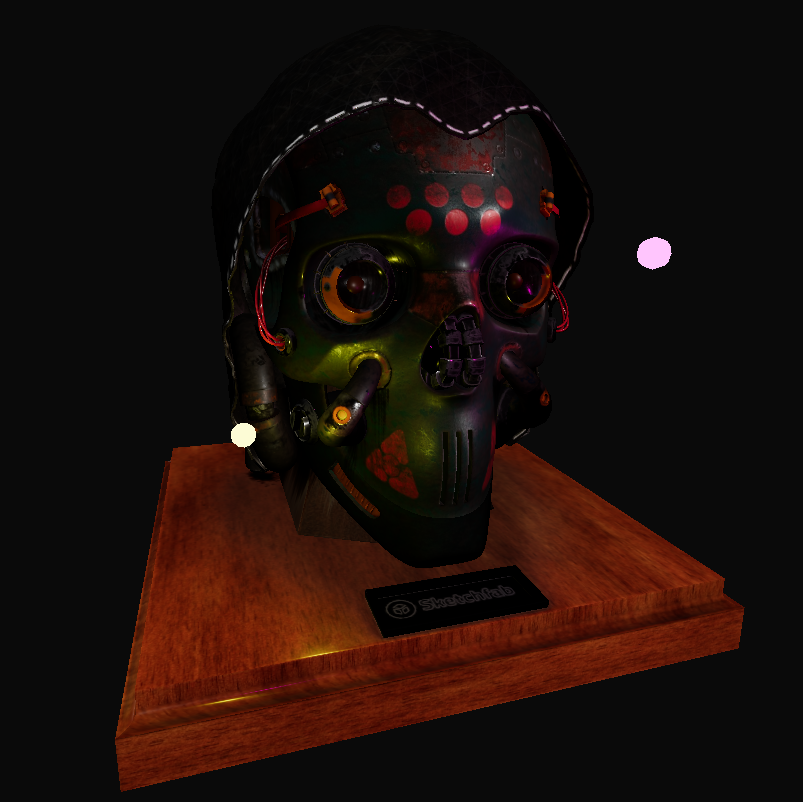

<h1 align="center">Shift: A Rendering Sandbox for Computer Graphics Research</h1>

Shift is a modern rendering engine based on the **Vulkan API**
that was designed for the graphics programmers to learn, practice, research, and optimize various rendering techniques.

Shift consists of 3 main parts:
- **[Shift API](https://github.com/Adeon18/Shift/tree/main/Source/Graphics/Abstraction)**
- **[Shift Rendering Systems](https://github.com/Adeon18/Shift/tree/main/Source/Graphics/Systems)**
- **[Shift UI](https://github.com/Adeon18/Shift/tree/main/Source/Graphics/UI)**

*Note: Since Shift 1.0 is done as a bachelor's thesis, more information about Shift structure and documentation will be released after the thesis publication in the future versions.* 

You can learn watch Shift rendering demo videos and images on the [webpage](https://shift.notionlinker.com/)!

---

### Features

A brief list of features in **Shift 1.0**:
- Model loading (GLTF, FBX, OBJ and more).
- Texture loading (PNG, TGA, JPG).
- Light System with Directional and Point lights supported.
- Physically Based Rendering *(For GLTF only models for now)*.
- HDR ToneMapping (Reinhard, Lottes, Uncharted 2 and ACES).
- A unique UI based upon Dear ImGui that provides a view of textures and render targets in real-time.
Also allows you to move and tweak lights. The UI is designed in a way to be easily attached to any system/class in Shift.

To load a custom 3D scene, go to `Renderer::LoadScene()` in [Renderer.cpp](https://github.com/Adeon18/Shift/blob/main/Source/Graphics/Renderer.cpp). It contains an example of how to do just that. *Scene loading is not a part of Shift 1.0, but it is a main priority for the future versions of Shift.*

---

### Prerequisites

1. Have a Windows 10/11.
2. Download the [MSVC 2022 compiler](https://visualstudio.microsoft.com/vs/features/cplusplus/) (is the only one supported as of Shift 1.0).
2. Download the [LunarG Vulkan SDK](https://www.lunarg.com/vulkan-sdk/) (ticking all boxes is recommended).
3. Set the VULKAN_SDK_PATH in [.env.cmake](https://github.com/Adeon18/Shift/blob/main/.env.cmake) to your SDK install directory.

#### Dependencies
Shift CMake system pulls all dependencies except for the Vulkan related ones (that come with Vulkan SDK). Here is a list of the dependencies that will be pulled:
- [spdlog](hhttps://github.com/gabime/spdlog.git)
- [GLFW](https://github.com/glfw/glfw.git)
- [GLM](https://github.com/g-truc/glm.git)
- [Dear ImGui](https://github.com/ocornut/imgui.git)
- [Assimp](https://github.com/assimp/assimp.git)
- [stb_image](https://github.com/nothings/stb.git): Provided in [Vendor\local](https://github.com/Adeon18/Shift/tree/main/Vendor/local).
---

### Building
**Using Clion:**
1. Open Shift as a new project and set the compiler to MSVC 2022 and build. Shift's CMake will do the rest.

**Using MSVC 2022:**
1. Generate the .sln with `mkdir Solution; cmake ..`.
2. Open the .sln with the MSVC 2022.
3. Set **Shift** as a startup project and build.
4. _Pray, I Guess..._
---

*Note: There will be a lot of warnings when building Assimp so don't get too scared:D*

After running Shift you should get a skeleton:

If that is so, congrats! You are now running Shift!

### Screenshots

*More demos, screenshots, additional documentation, and credits to 3D modelers are on the Shift [webpage](https://shift.notionlinker.com/)!*

### Credits
- [Ostap "Ade0n" Trush](https://github.com/Adeon18): Development.
- [Danylo Rudenko](https://github.com/danylorudenko): Mentorship.
